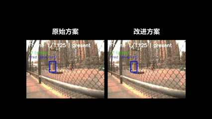
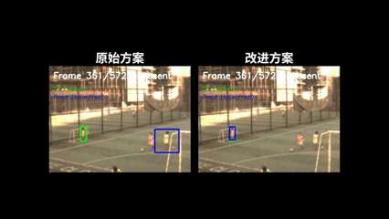
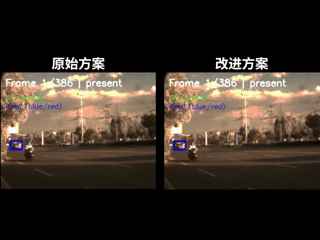
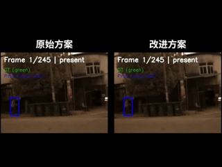
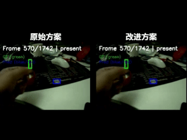

# EvTrack: Event Camera-based Object Tracking

> English | [简体中文](README-zh-CN.md)

## Overview

EvTrack is a research project focused on **single-object tracking with event
cameras**. Event cameras offer microsecond temporal resolution and high
dynamic range, making them ideal for high-speed and extreme-lighting scenarios
where traditional frame-based cameras struggle.

This project reproduces and evaluates two RGB-Event multi-modal trackers on the
[VisEvent](https://github.com/wangxiao5791509/VisEvent_SOT_Benchmark) benchmark:

- **[ViPT](https://github.com/jiawen-zhu/ViPT)** (CVPR 2023) — visual-prompt
  multi-modal tracking, plus an online-template improvement we developed.
- **[SDSTrack](https://github.com/hoqolo/SDSTrack)** (CVPR 2024) —
  self-distillation symmetric adapter tracking.

## ViPT

Reproduction and an online-template improvement of ViPT. The reproduction and
improvement code lives in a separate fork:

> **https://github.com/kriss-spy/ViPT** — branch
> [`vipt-improvement`](https://github.com/kriss-spy/ViPT/tree/vipt-improvement)

See [`code/ViPT/README.md`](code/ViPT/README.md) for the key changes vs.
upstream and usage instructions.

### Online-template improvement

We added a pair of online templates (RGB + event) with an SSIM-gated update
rule to the original ViPT tracker — **no extra training**, just the original
checkpoint. This is a remedial measure that improves tracking on some VisEvent
sequences but cannot fix fundamentally bad cases, and can hurt performance in
others.

Demo GIFs (original vs. improved):






Failure case — the online template can also hurt performance:



### Further research

- [ViPT quantization research plan](docs/vipt-quantization-research.md) —
  FP16/INT8 PTQ/QAT roadmap (Issue #9).

## SDSTrack

Reproduction of SDSTrack on the VisEvent test set (319/320 sequences;
MATLAB-equivalent protocol excluding absent frames):

| Tracker | Success AUC | Precision @ 20px | vs. paper |
|---------|------------:|-----------------:|-----------|
| **SDSTrack** (reproduction) | **0.5829** | **0.7506** | within 2% |
| SDSTrack (paper) | 0.597 | 0.767 | — |

- Code & quick start: [`code/SDSTrack/`](code/SDSTrack/)
- Results, metrics, and reproduction log:
  [`experiments/sdstrack/`](experiments/sdstrack/)
- Per-sequence prediction archive:
  [`krisspy39/visevent-sdstrack-results`](https://huggingface.co/datasets/krisspy39/visevent-sdstrack-results)
  on Hugging Face.
- Full VisEvent reproduction report:
  [`docs/事件相机目标跟踪.pdf`](docs/事件相机目标跟踪.pdf)

## Documentation

A full, categorized index of all project documentation is in
[`docs/README.md`](docs/README.md). Highlights:

- [Project report](docs/report.md) — forthcoming (Issue #27)
- [Project proposal (开题报告)](docs/project-proposal.md)
- [Dataset setup guide](docs/dataset-setup.md)
- [Course project guide & grading rubric](docs/course-project-guide.md)
- [Event-camera survey reading notes](docs/Event-Based%20Vision.md)
- [SDSTrack reproduction experiment](experiments/sdstrack/README.md)

## Datasets

- [VisEvent](https://github.com/wangxiao5791509/VisEvent_SOT_Benchmark) —
  primary benchmark; also mirrored on
  [Hugging Face](https://huggingface.co/datasets/krisspy39/visevent).
- [COESOT](https://github.com/Event-AHU/COESOT) — secondary (pending
  acquisition).

See [docs/dataset-setup.md](docs/dataset-setup.md) for download details.

## Project Structure

```
.
├── code/               # Tracker implementations
│   ├── SDSTrack/       #   SDSTrack reproduction (upstream submodule + eval scripts)
│   └── ViPT/           #   Pointer to kriss-spy/ViPT fork (vipt-improvement branch)
├── experiments/        # Experiment configs, metrics, reproduction logs
├── scripts/            # Shared evaluation metric scripts
├── data/               # Dataset paths and setup guides (not raw data)
├── results/            # Evaluation outputs, plots, videos
├── docs/               # Documentation and guides
├── gif/                # Tracking demo GIFs
├── requirements.txt
└── README.md
```

## Quick Start

### Common setup

```bash
# Clone with submodules
git clone --recurse-submodules https://github.com/kriss-spy/EvTrack

# Or if already cloned:
git submodule update --init

# Install base dependencies
pip install -r requirements.txt
```

### ViPT

```bash
# Clone the fork separately
git clone -b vipt-improvement https://github.com/kriss-spy/ViPT

# Evaluate on VisEvent
cd ViPT
bash eval_rgbe.sh --seq_home /path/to/VisEvent/test --save_dir ./RGBE_workspace/results
```

See [`code/ViPT/README.md`](code/ViPT/README.md) for details.

### SDSTrack

```bash
# Run evaluation
python code/SDSTrack/sdstrack_eval.py --workspace /workspace/sdstrack

# Compute metrics (MATLAB-equivalent protocol)
python scripts/eval_visevent_matlab.py --results <path> --dataset <path>
```

See [`code/SDSTrack/README.md`](code/SDSTrack/README.md) for details.

## References

[1] Zhu J, Lai S, Chen X, et al. Visual prompt multi-modal tracking. In *CVPR* 2023: 9516-9526.

[2] Wang X, Li J, Zhu L, et al. VisEvent: Reliable object tracking via collaboration of frame and event flows. *IEEE T-CYB*, 2023, 54(3):1997-2010.

[3] Tang C, Wang X, Huang J, et al. Revisiting color-event based tracking: A unified network, dataset, and metric. *Pattern Recognition*, 2025, 7:112718.

## License

This project is for academic and research purposes.
